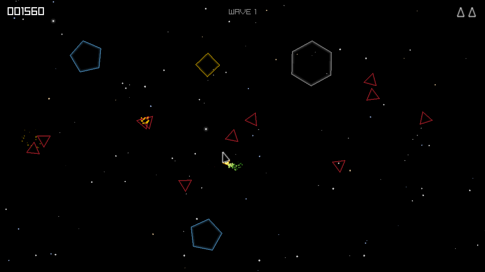

# Dioretsa

An asteroids game about flying badly. Wait... are _those_ following me?



## Playing

| Key             | Action           |
| --------------- | ---------------- |
| Left/Right, A/D | turn             |
| Up, W           | thrust           |
| Space           | fire             |
| P               | pause            |
| R               | restart          |
| M               | music on/off     |
| Esc             | quit, asks first |


## Running it

Download the zip for your machine, unpack it, and run the program inside. The
folder holds the game and its assets; keep them together.

It is not signed, so macOS refuses it the first time. Right-click the program,
choose Open, and confirm; after that it starts normally.

## Building it

```sh
brew install raylib cmake just
just run
```

`just` on its own lists everything else, including `just bundle-mac`, which
builds a version that runs on any Mac without Homebrew.

## Credits

Music: [Dark Cinematic Ambient Tension v2](https://pixabay.com/music/chase-scene-dark-cinematic-ambient-tension-v2-461304/)
by RubyZephyr, from Pixabay.

Type: [Archivo Black](https://fonts.google.com/specimen/Archivo+Black) by
Omnibus-Type, under the SIL Open Font License 1.1. The licence sits next to the
font in `assets/OFL.txt`.

Built with [raylib](https://www.raylib.com/).

Sound effects made with [rfxgen](https://raylibtech.itch.io/rfxgen).

